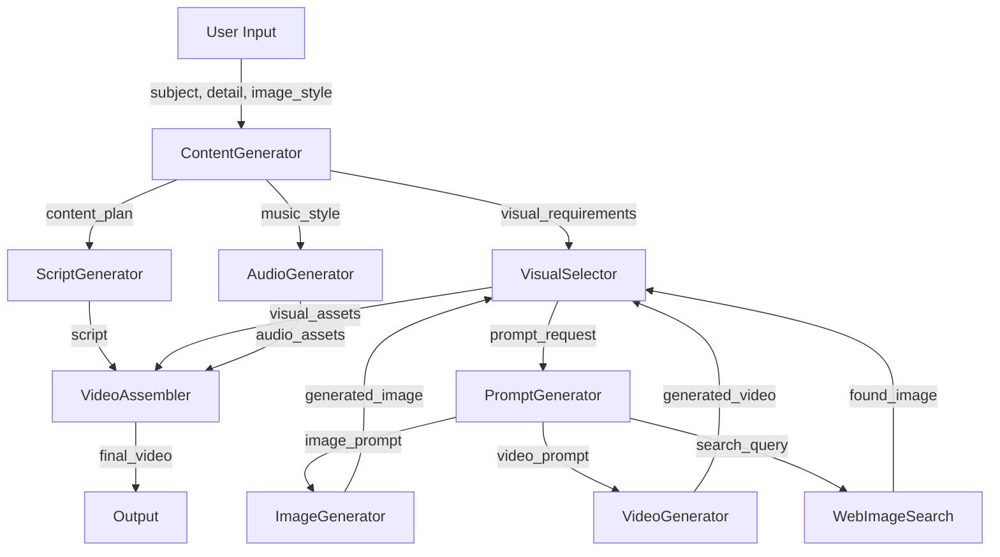
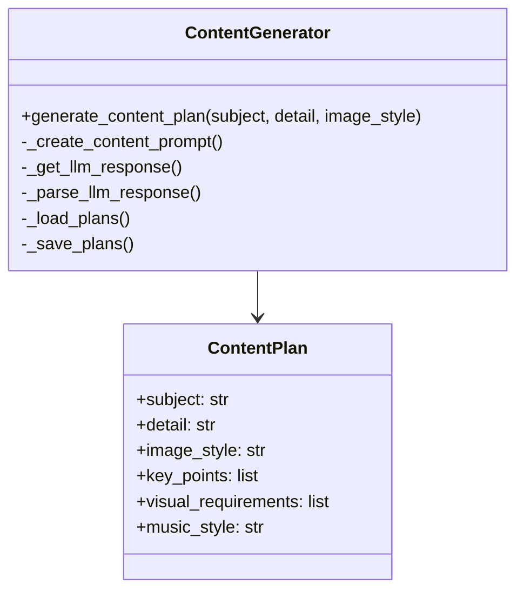
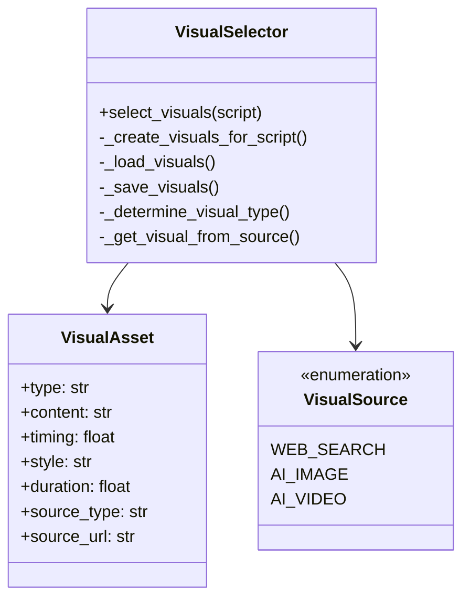
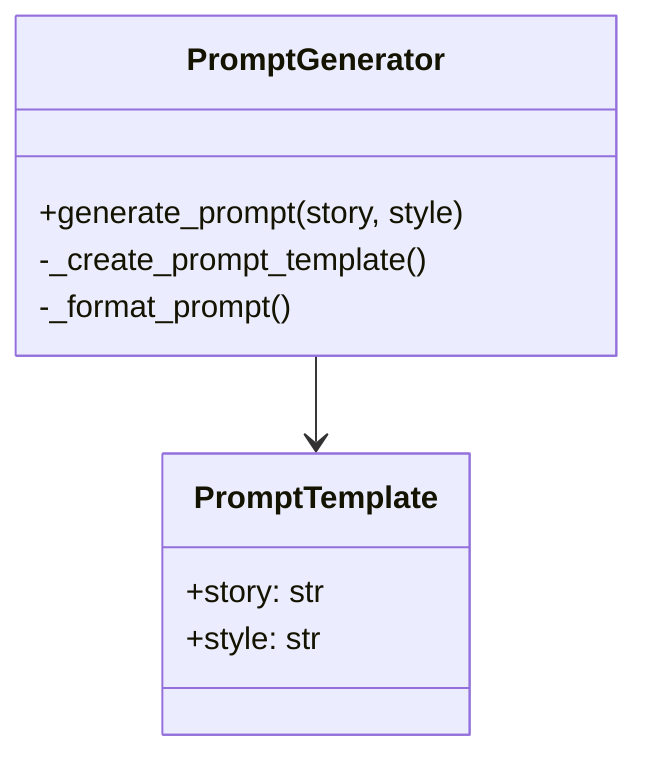
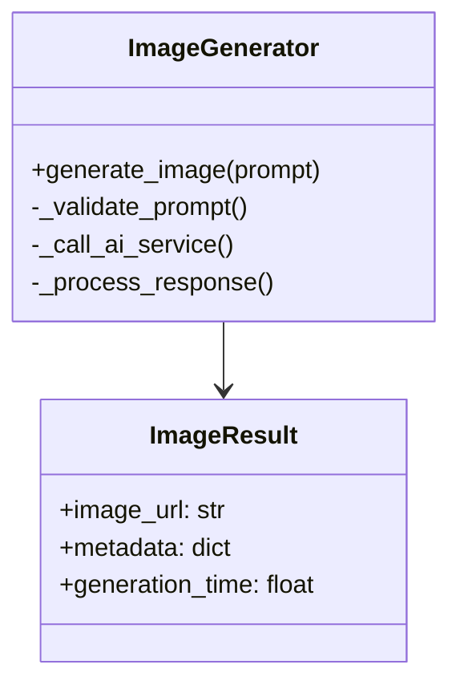
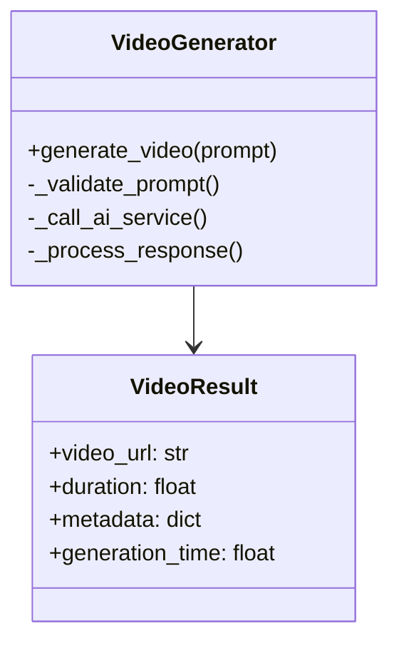
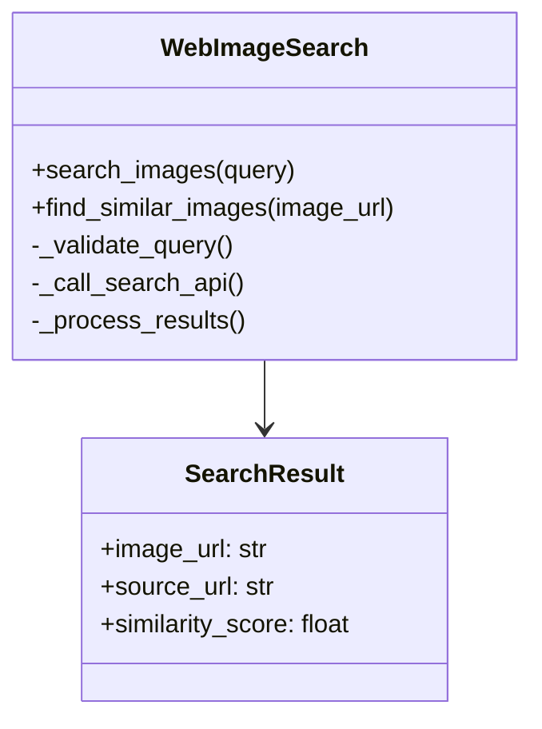
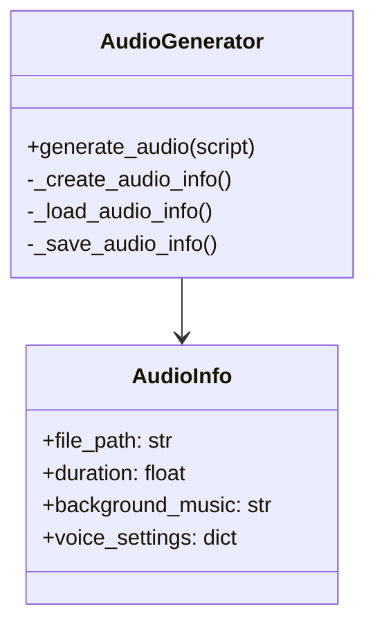
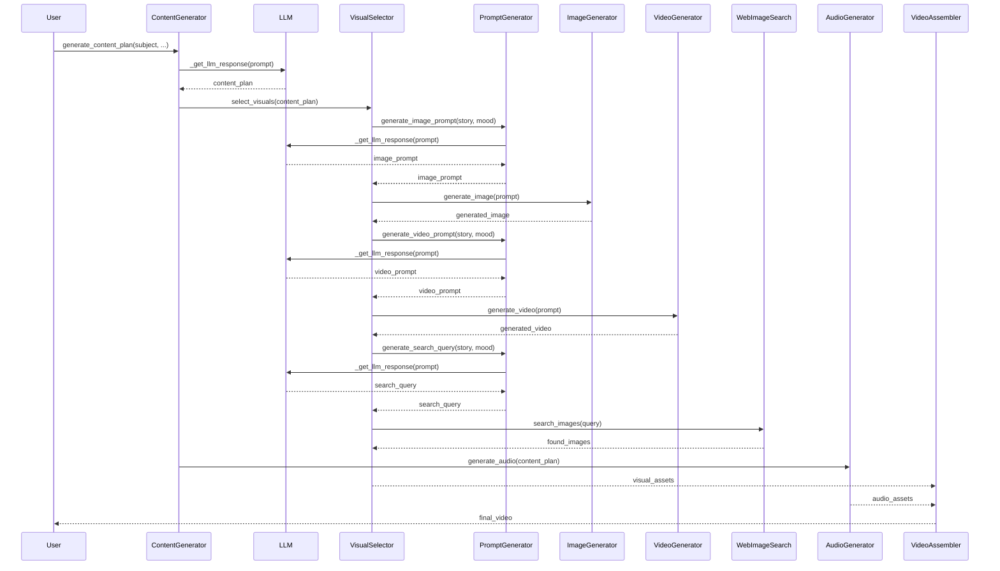
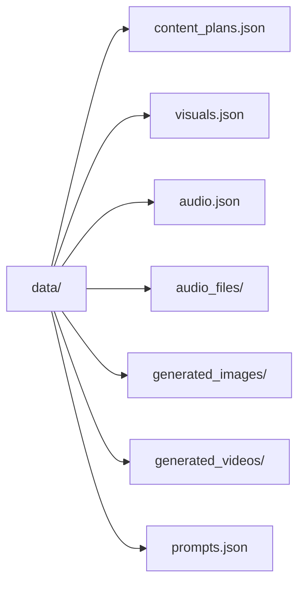

# ShortFactory System Architecture

## System Overview

## Component Details

### ContentGenerator

### VisualSelector

### PromptGenerator

### ImageGenerator

### VideoGenerator

### WebImageSearch

### AudioGenerator

## Data Flow

## Storage Structure

## Component Parameters

### ContentGenerator
- Input:
  - subject: str (e.g., "Interesting facts about Octopuses")
  - detail: str (additional description)
  - image_style: str (visual style)
- Output:
  - content_plan: Dict containing hook, key_points, conclusion, visual_requirements, music_style

### VisualSelector
- Input:
  - script: str (from ContentGenerator)
- Output:
  - List[Dict] containing visual assets with type, content, timing, style, duration, source_type, source_url

### PromptGenerator
- Input:
  - story: str (content to visualize)
  - style: str (visual style)
- Output:
  - image_prompt: str (for AI image generation)
  - video_prompt: str (for AI video generation)
  - search_query: str (for web image search)

### ImageGenerator
- Input:
  - prompt: str (from PromptGenerator)
- Output:
  - ImageResult containing image_url and metadata

### VideoGenerator
- Input:
  - prompt: str (from PromptGenerator)
- Output:
  - VideoResult containing video_url and metadata

### WebImageSearch
- Input:
  - query: str (from PromptGenerator)
  - image_url: str (optional, for similar image search)
- Output:
  - List[SearchResult] containing matching images

### AudioGenerator
- Input:
  - script: str (from ContentGenerator)
- Output:
  - Dict containing audio_info with file_path, duration, background_music, voice_settings 